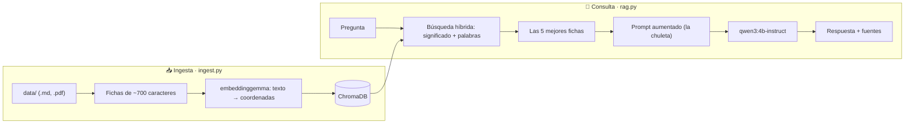

# 🤖 Más allá del Prompt: un RAG que corre en tu laptop

**Haz que tu IA deje de alucinar. Sin nube, sin API keys, sin internet.**

Este repositorio es la demo de la charla *"Más allá del Prompt: Construyendo sistemas RAG para que tu IA deje de alucinar"* del **AWS Student Community Day Cochabamba 2026**. Es un asistente que responde preguntas sobre el evento **citando sus fuentes** y que dice **"No lo sé"** cuando el dato no está en los documentos. Todo corre en una laptop con una GPU de 4 GB, incluso en modo avión.

¿Lo mejor? Está hecho para que lo **rompas, lo cambies y aprendas**. Si viniste a la charla, este es tu laboratorio. Si no viniste, también. 🚀

---

## 🧠 La idea en 4 imágenes

| Imagen | En la vida real | En el código |
|---|---|---|
| 📖 **Examen a libro abierto** | El modelo no tiene que saberlo todo de memoria: le damos los apuntes | RAG = *Retrieval-Augmented Generation* |
| 🗺️ **Fichas en un mapa de significado** | Partimos los documentos en fichas y las ubicamos en un mapa donde lo parecido queda cerca | *Chunks* + *embeddings* (`ingest.py`) |
| 🧑‍🏫 **El bibliotecario** | Ante una pregunta, trae las fichas más cercanas | Base vectorial + búsqueda (`rag.py → buscar`) |
| 📝 **La chuleta permitida** | El modelo responde **solo** con esas fichas, y lo dice si no le alcanzan | Prompt aumentado (`rag.py → PROMPT_RAG`) |



---

## 🎬 Qué puedes hacer con la demo

- **Ver alucinar al modelo:** pregunta sin RAG quién habla después del almuerzo en el Main Stage. Inventa con total seguridad. (En los ensayos llegó a cambiarle el nombre a la universidad 😅)
- **Ver cómo deja de alucinar:** la misma pregunta con RAG responde con el dato correcto y su fuente.
- **Tenderle trampas:** pregúntale la contraseña del wifi. Debe decir "No lo sé".
- **Enseñarle algo nuevo en vivo:** sube un PDF desde la app y en segundos ya responde con él. Sin reentrenar nada.
- **Medir si miente:** un modelo juez (*LLM-as-a-Judge*) califica las respuestas con un dataset dorado de 10 preguntas. Y sí: **el juez también se equivoca**, y aquí puedes ver cómo se le arregla.

---

## 🧰 Lo que necesitas

| | Mínimo | Lo que usamos |
|---|---|---|
| Sistema | Windows 11 (probado). En Linux o macOS debería funcionar cambiando los comandos de instalación | Windows 11 |
| RAM | 16 GB | 32 GB |
| GPU | Opcional. Sin GPU funciona en CPU, solo que más lento | NVIDIA RTX 3050 Ti Laptop (4 GB) |
| Disco | ~8 GB libres para los modelos | |
| Internet | Solo para instalar. Después, modo avión ✈️ | |

---

## 🛠️ Instalación paso a paso (Windows 11)

### 1. Herramientas
En PowerShell, una línea a la vez:
```powershell
winget install --id Git.Git -e
winget install --id Python.Python.3.13 -e
winget install --id Microsoft.VisualStudioCode -e
winget install --id Ollama.Ollama -e
Set-ExecutionPolicy -Scope CurrentUser RemoteSigned
```
Si tienes GPU NVIDIA, instala el driver más reciente (NVIDIA App) y verifica con `nvidia-smi`. Cierra y vuelve a abrir PowerShell.

### 2. Ajustes de Ollama para GPUs pequeñas (opcional, recomendado)
Reducen a la mitad la memoria que usa la conversación:
```powershell
setx OLLAMA_FLASH_ATTENTION 1
setx OLLAMA_KV_CACHE_TYPE q8_0
```
Cierra Ollama desde el ícono de la llama junto al reloj (*Quit Ollama*) y ábrelo otra vez. Si te pide cuenta, elige **continuar de forma local**.

### 3. Modelos (~6.5 GB)
```powershell
ollama pull qwen3:4b-instruct
ollama pull embeddinggemma
ollama pull gemma3:4b
```
| Modelo | Rol |
|---|---|
| `qwen3:4b-instruct` | El que responde (generador) |
| `embeddinggemma` | El que ubica cada ficha en el mapa de significado |
| `gemma3:4b` | El juez. De otra familia, para que el modelo no se califique a sí mismo |

> 💡 Ojo: usa `qwen3:4b-instruct`, no `qwen3:4b`. Esa otra variante "piensa" en voz alta en inglés antes de responder y tarda muchísimo más.

### 4. El proyecto
```powershell
git clone https://github.com/Hcc2023/mas-alla-del-prompt.git
cd mas-alla-del-prompt
py -3.13 -m venv .venv
.\.venv\Scripts\Activate.ps1
python -m pip install --upgrade pip
pip install -r requirements.txt
```
Deberías ver `(.venv)` al inicio de la línea. Cada vez que abras una terminal nueva, actívalo con `.\.venv\Scripts\Activate.ps1`.

### 5. ¡A jugar!
```powershell
python ingest.py          # indexa los documentos de data/
streamlit run app.py      # abre la demo en el navegador
```

---

## 🕹️ Cómo se usa

| Comando | Qué hace |
|---|---|
| `python ingest.py` | Reindexa todo `data/` desde cero |
| `python ingest.py ruta\archivo.pdf` | Agrega o actualiza un solo archivo |
| `python preguntar.py "tu pregunta"` | Misma pregunta **sin RAG y con RAG** en la terminal, más las fichas que usó |
| `streamlit run app.py` | La demo visual: botones con preguntas, modo con/sin RAG y subida de documentos |
| `python evaluate.py` | El juez califica las 10 preguntas de `golden_set.json` |
| `python evaluate.py --version-juez 1` | El juez original, con sus falsos negativos (spoiler: castiga respuestas correctas) |
| `python evaluate.py --ids 7 8` | Evalúa solo algunas preguntas |
| `reset_demo.bat` | Vuelve la demo al estado inicial, corre una prueba de humo y abre la app |

**El remate de la charla, para que lo repitas:**
1. En la app pregunta: *"¿Dónde puedo descargar el código de la charla de Heberht?"* → "No lo sé".
2. Sube `remate/apuntes_heberht.pdf` desde la barra lateral y pulsa **Indexar ahora**.
3. Pregunta de nuevo → responde con el enlace a este repositorio, citando el PDF. 🎉

---

## 📁 Qué hay en cada archivo

```
data/               documentos del evento (agenda por sala, información general, FAQ)
remate/             el PDF de apuntes que se agrega en vivo
rag.py              el corazón: modelos, búsqueda híbrida y prompt
ingest.py           parte los documentos en fichas y los guarda en ChromaDB
preguntar.py        prueba en terminal: sin RAG vs con RAG
app.py              la demo en Streamlit
evaluate.py         LLM-as-a-Judge (juez v1 y v2)
golden_set.json     10 preguntas con su respuesta esperada (nuestras pruebas de regresión)
reset_demo.py/.bat  reinicio + prueba de humo
resultados/         evaluaciones guardadas
```

---

## 🔍 Decisiones que aprendimos por el camino

Estas son las partes que no salen en los tutoriales, y donde más se aprende:

- **Preparar los datos importa tanto como el modelo.** Cada sesión de la agenda dice qué hay *antes* y *después* en la misma sala. Sin eso, el bibliotecario nunca podría responder "¿quién habla después de…?", porque esa información no estaría en ninguna ficha.
- **Búsqueda híbrida.** Solo con embeddings, una pregunta con mucho texto de más ("estoy en el evento de la UPB…") se iba hacia las fichas genéricas. Sumar búsqueda por palabras exactas (BM25) rescata nombres y títulos.
- **Instrucciones de tarea para EmbeddingGemma.** Anteponer `task: search result | query:` a las preguntas y `title: none | text:` a las fichas mejora la búsqueda.
- **Temperatura 0 y semilla fija.** La misma pregunta da la misma respuesta en el ensayo y en vivo.
- **Contexto corto (2048 tokens).** Deja más capas del modelo en la GPU de 4 GB.
- **Comparación justa.** Con y sin RAG, el modelo recibe la misma regla de largo. La única diferencia son los documentos.
- **El juez también se prueba.** El juez v1 reprobaba respuestas correctas ("No lo sé" en preguntas trampa). El bug estaba en el oráculo, no en el sistema. El v2 lo corrige con una frase y marcando que la relevancia no aplica en las trampas.

**Y un límite honesto:** RAG le da *conocimiento* al modelo, no *reloj* ni *calculadora*. "¿Quién está hablando ahora y cuánto falta?" necesita herramientas, y eso ya es territorio de agentes.

---

## 🧪 Retos para que te ensucies las manos

Empieza por el que te dé más curiosidad. Después de cada cambio, corre `python evaluate.py` y mira si mejoró o empeoró. Así se trabaja en serio. 😉

1. **🔄 Cambia el cerebro.** Prueba otro generador en `rag.py` (`MODELO_LLM`). ¿Mejora? ¿Alucina más? ¿Cabe en tu GPU? (`ollama ps` te lo dice)
2. **✂️ Juega con las fichas.** Cambia `chunk_size` en `ingest.py` a 300 o a 1500 y reindexa. ¿Qué pasa con las respuestas?
3. **🔦 Apaga una linterna.** Quita la búsqueda por palabras (BM25) de `buscar()` y vuelve a hacer la pregunta larga. ¿El bibliotecario se pierde?
4. **📚 Tu propio asistente.** Cambia `data/` por el sílabo de tu materia, el reglamento de tu universidad o tus apuntes. Ajusta el prompt en `rag.py`.
5. **🪤 Escribe trampas nuevas.** Agrega preguntas a `golden_set.json`. ¿Puedes hacer que el sistema invente algo?
6. **⚖️ Rompe al juez.** Encuentra una respuesta mala que el juez apruebe (un falso positivo) y mejora su prompt.
7. **☁️ Llévalo a la nube.** Cada pieza local tiene su equivalente en AWS:

| Local | AWS |
|---|---|
| Carpeta `data/` | Amazon S3 |
| Ollama (LLM) | Amazon Bedrock |
| embeddinggemma | Embeddings de Bedrock (Titan Text Embeddings V2, Cohere Embed Multilingual) |
| ChromaDB | Amazon S3 Vectors, OpenSearch Serverless o Aurora con pgvector |
| Pipeline de LangChain | Amazon Bedrock Knowledge Bases |
| App Streamlit | AWS Lambda o Amazon ECS |
| Juez local | Amazon Bedrock Evaluations |

---

## 🧯 Si algo falla

| Síntoma | Qué revisar |
|---|---|
| Responde muy lento | `ollama ps`: si dice mucho % CPU, cierra apps que usan la GPU o prueba un modelo más pequeño |
| `ModuleNotFoundError` | ¿Activaste el `.venv`? ¿Corriste `pip install -r requirements.txt`? |
| La app no ve documentos nuevos | Si reindexaste todo con `python ingest.py` con la app abierta, ciérrala y ábrela de nuevo |
| `requirements.txt` raro en GitHub | En PowerShell usa `pip freeze \| Out-File -Encoding ascii requirements.txt` en lugar de `>` |

---

## 🙌 Créditos

Hecho con mucha curiosidad (y muchas pruebas 🧪) por **Heberht Castellon**, QA Engineer, para el AWS Student Community Day Cochabamba 2026.

🔗 [LinkedIn](https://www.linkedin.com/in/heberht-castell%C3%B3n-profesionalqa)

Datos de la agenda: [studentcommunity.day](https://studentcommunity.day/agenda), consultados el 3 de octubre de 2026.

Stack: [Ollama](https://ollama.com) · [LangChain](https://www.langchain.com) · [ChromaDB](https://www.trychroma.com) · [Streamlit](https://streamlit.io) · [rank-bm25](https://github.com/dorianbrown/rank_bm25) · [Rich](https://github.com/Textualize/rich)

**¿Lo hiciste funcionar, lo rompiste o lo mejoraste? ¡Cuéntamelo!** Abre un *issue*, manda un *pull request* o escríbeme por LinkedIn. Me encantará ver qué construyes. 💙
